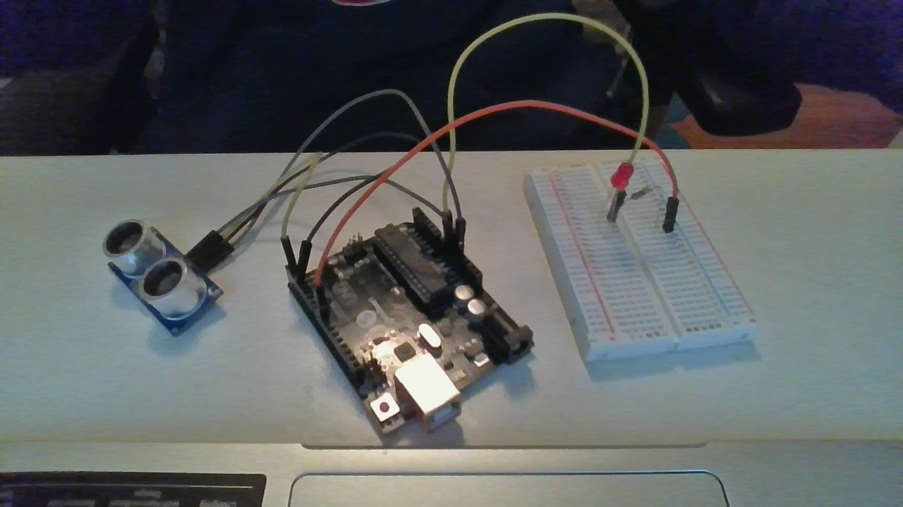

# NotSoBasicArduino
 The follwing files are my second foray into Arduino
 
 
## Table of Contents
* [Table of Contents](#TableOfContents)
* [LED_Fade](#LED_Fade)
* [Hello_LCD](#Hello_LCD)
* [FillMeInLAter](#FillMeInLAter)
---

## LED_Fade

### Description & Code
In this LED fade assignment I learned how to make an LED fade. I built a circuit putting the wires in the 9 and GND slots.

Here's how you make code look like code:

int led = 9;           // the PWM pin the LED is attached to
int brightness = 0;    // how bright the LED is
int fadeAmount = 5;    // how many points to fade the LED by

// the setup routine runs once when you press reset:
void setup() {
  // declare pin 9 to be an output:
  pinMode(led, OUTPUT);
}

// the loop routine runs over and over again forever:
void loop() {
  // set the brightness of pin 9:
  analogWrite(led, brightness);

  // change the brightness for next time through the loop:
  brightness = brightness + fadeAmount;

  // reverse the direction of the fading at the ends of the fade:
  if (brightness <= 0 || brightness >= 255) {
    fadeAmount = -fadeAmount;
  }
  // wait for 30 milliseconds to see the dimming effect
  delay(30);
}
Talk about how the fade works, here....

### Evidence
[The link to my arduino create fade](https://create.arduino.cc/editor/ayates67/b139f68a-321a-49c1-83cd-8a7b8c837c92)
### Images

### Reflection
THis assignment was really tough but it taught me how to use arduino create. I learned the basics and learned how to build a circuit. I also learned that I need to work smarter and not harder. Sometimes I do things the hard way and then mess up.
## Finite LED Blinker

### Description & Code

In this assignment I made an led blink 5 times and then stop and count on the serial monitor.


Here's how you make code look like code:

```C++
int counter = 0;

// the setup function runs once when you press reset or power the board
void setup() {
  Serial.begin(9600);
  // initialize digital pin LED_BUILTIN as an output.
  pinMode(LED_BUILTIN, OUTPUT);
}

// the loop function runs over and over again forever
void loop() {
  if (counter < 5){
  Serial.println(counter + 1);
  digitalWrite(LED_BUILTIN, HIGH);   // turn the LED on (HIGH is the voltage level)
  delay(100);                       // wait for a second
  digitalWrite(LED_BUILTIN, LOW);    // turn the LED off by making the voltage LOW
  delay(1000);                       // wait for a second
  counter = counter + 1;}
}

```The serial println made the counter show up on the serial monitor. The if statement made it so if the counter was < 5 then the computer should run the loop again.

### Evidence
[Link to my sketch](https://create.arduino.cc/editor/ayates67/deb3231b-3ad6-4168-be88-0777e440ba62/preview)

### Images


### Reflection
This assignment challenged me alot. I learned about counters and if statement to make the Led blink five time. With the help of my Dad, I figured out how to make an arduino blink and use a counter in serial monitor.

## Arduino Assignment

### Description & Code

In this assignment I made an led blink faster every second until in got to 100.


Here's how you make code look like code:

```C++
int counter = 0;

// the setup function runs once when you press reset or power the board
void setup() {
  // initialize digital pin LED_BUILTIN as an output.
  pinMode(ledPin, OUTPUT);
  Serial.begin(9600);
}

// the loop function runs over and over again forever
void loop() {
  Serial.println(delayVar);
  digitalWrite(ledPin, HIGH);   // turn the LED on (HIGH is the voltage level)
  delay(delayVar);                       // wait for a second
  digitalWrite(ledPin, LOW);    // turn the LED off by making the voltage LOW
  delay(delayVar);                       // wait for a second
  if(delayVar > 100){
  delayVar = delayVar - 100;}
  

  
}
```The serial println made the counter show up on the serial monitor. The if statement made it so if the counter was < 5 then the computer should run the loop again.

### Evidence
[Link to my sketch](https://create.arduino.cc/editor/ayates67/b0792fc8-d174-4494-8bf7-7c2a47c18c06/preview)

### Images
I couldn't figure out how to add a video to github.

### Reflection
In this assignment I made an LED blink faster every second. It was very hard but I pushed through and get trying. I figured out that I needed the variable"delayvar" to make it delay.

## Hello Functions

### Description & Code
In this assignment I made the LED blink depending on how far the ultrasonic sensor detected.


Here's how you make code look like code:

```// ---------------------------------------------------------------- //
// Arduino Ultrasoninc Sensor HC-SR04
// Re-writed by Arbi Abdul Jabbaar
// Using Arduino IDE 1.8.7
// Using HC-SR04 Module
// Tested on 17 September 2019
// ---------------------------------------------------------------- //

#define echoPin 2 // attach pin D2 Arduino to pin Echo of HC-SR04
#define trigPin 3 //attach pin D3 Arduino to pin Trig of HC-SR04

// defines variables
long duration; // variable for the duration of sound wave travel
int distance; // variable for the distance measurement
int pin = 8;
int LED = 8;


void setup() {
  pinMode(trigPin, OUTPUT); // Sets the trigPin as an OUTPUT
  pinMode(echoPin, INPUT); // Sets the echoPin as an INPUT
  pinMode(pin, OUTPUT);
  pinMode(LED, INPUT);
  Serial.begin(9600); // // Serial Communication is starting with 9600 of baudrate speed
  Serial.println("Ultrasonic Sensor HC-SR04 Test"); // print some text in Serial Monitor
  Serial.println("with Arduino UNO R3");
}
void loop() {
  // Clears the trigPin condition
  digitalWrite(trigPin, LOW);
  delayMicroseconds(2);
  // Sets the trigPin HIGH (ACTIVE) for 10 microseconds
  digitalWrite(trigPin, HIGH);
  delayMicroseconds(10);
  digitalWrite(trigPin, LOW);
  // Reads the echoPin, returns the sound wave travel time in microseconds
  duration = pulseIn(echoPin, HIGH);
  // Calculating the distance
  distance = duration * 0.034 / 2; // Speed of sound wave divided by 2 (go and back)
  // Displays the distance on the Serial Monitor
  if (distance < 100){digitalWrite(LED, OUTPUT);}
  Serial.print("Distance: ");
  Serial.print(distance);
  Serial.println(" cm");
  delay(1000);
}

```
### Evidence
[Link to my sketch](https://create.arduino.cc/editor/ayates67/9e4d879e-5878-4f52-abf6-4be0e9ec4e52)

### Images


### Reflection
In this assignment I made an LED blink when ever the ultra sonic sensor sensed a certain distance. This took me a while but I figured out where and how an if statement worked and got the assignment done.

## New Ping

### Description & Code
In this asignment I used the new ping library to make an LED get dimmer depend on the distance that the ultra sonic sensor read.
Here's how you make code look like code:

```// ---------------------------------------------------------------- //
// Arduino Ultrasoninc Sensor HC-SR04
// Re-writed by Arbi Abdul Jabbaar
// Using Arduino IDE 1.8.7
// Using HC-SR04 Module
// Tested on 17 September 2019
// ---------------------------------------------------------------- //

#define echoPin 2 // attach pin D2 Arduino to pin Echo of HC-SR04
#define trigPin 3 //attach pin D3 Arduino to pin Trig of HC-SR04

// defines variables
long duration; // variable for the duration of sound wave travel
int distance; // variable for the distance measurement
int pin = 9;
int LED = 9;
#include <NewPing.h>
 
#define TRIGGER_PIN 3
#define ECHO_PIN 2
#define MAX_DISTANCE 200
 
NewPing myHCSR04(TRIGGER_PIN, ECHO_PIN, MAX_DISTANCE);


void setup() {
  pinMode(trigPin, OUTPUT); // Sets the trigPin as an OUTPUT
  pinMode(echoPin, INPUT); // Sets the echoPin as an INPUT
  pinMode(pin, OUTPUT);
  pinMode(LED, INPUT);
  Serial.begin(9600); // // Serial Communication is starting with 9600 of baudrate speed
  Serial.println("Ultrasonic Sensor HC-SR04 Test"); // print some text in Serial Monitor
  Serial.println("with Arduino UNO R3");
}
void loop() {
  digitalWrite(trigPin, LOW);
  delayMicroseconds(2);
  // Sets the trigPin HIGH (ACTIVE) for 10 microseconds
  digitalWrite(trigPin, HIGH);
  delayMicroseconds(10);
  digitalWrite(trigPin, LOW);
  // Reads the echoPin, returns the sound wave travel time in microseconds
  duration = pulseIn(echoPin, HIGH);
  // Calculating the distance
  distance = (myHCSR04.ping_cm());
  // Displays the distance on the Serial Monitor
  Serial.print("Distance: ");
  Serial.print(distance);
  Serial.println(" cm");
  analogWrite(LED, 7* distance);
  
}

```
### Evidence
[Link to my sketch](https://create.arduino.cc/editor/ayates67/fb65c71b-3a2f-47d4-a7bb-9317cee1535c)

### Images


### Reflection
In this assignment I made an LED get ligher and dimmer when ever the ultra sonic sensor sensed a certain distance. This took me a while but I finally figured out how to used new ping after many errors and downloads.

## Photoresister

### Description & Code
In this assignment I made a night light that turns on when it's dark and off when it's light. I used a photoresister to detect the light and a basic led for my light. I learned how the lines on the resisters work also.
Here's how you make code look like code:

```/*
  Blink

  Turns an LED on for one second, then off for one second, repeatedly.

  Most Arduinos have an on-board LED you can control. On the UNO, MEGA and ZERO
  it is attached to digital pin 13, on MKR1000 on pin 6. LED_BUILTIN is set to
  the correct LED pin independent of which board is used.
  If you want to know what pin the on-board LED is connected to on your Arduino
  model, check the Technical Specs of your board at:
  https://www.arduino.cc/en/Main/Products

  modified 8 May 2014
  by Scott Fitzgerald
  modified 2 Sep 2016
  by Arturo Guadalupi
  modified 8 Sep 2016
  by Colby Newman

  This example code is in the public domain.

  http://www.arduino.cc/en/Tutorial/Blink
*/
int analogPin = A0;
int val = 0;
int LED_BUILTI = 8;


// the setup function runs once when you press reset or power the board
void setup() {
  Serial.begin(9600);
  pinMode(LED_BUILTIN, OUTPUT);
  
}

// the loop function runs over and over again forever
void loop() {
  Serial.println();
  val = analogRead(analogPin);
  Serial.println(val);
  if (val < 100){digitalWrite(LED_BUILTI, HIGH);}
  else if (val > 100){digitalWrite(LED_BUILTI, LOW);}
  delay(1000);                       // wait for a second
  
}


```
### Evidence
[Link to my sketch](https://create.arduino.cc/editor/ayates67/44e0fd1b-70b6-4da1-82df-ecfd25977825)

### Images


### Reflection
In this assignment I made an LED turn on when the light went off and turn off when the lights turn on. It is basically like a night light. This assignment was a little easier than new ping but it did have its challenges. It was hard tomunderstand how to use analog for me.
